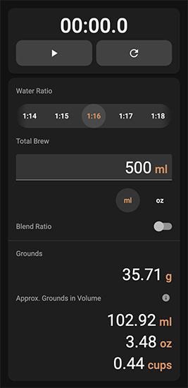

# Coffee Ratio




Web App: https://godly-devotion.github.io/coffee-ratio/

Calculate amount of beans needed for home brewed coffee, even without a scale! Built with full PWA (Progressive Web App) support, it works even without an internet connection.


## How To Install

### Android

Install the Coffee Ratio app from the [Google Play Store](https://play.google.com/store/apps/details?id=com.godly_devotion.coffee_ratio). If you'd like to test out the app before you buy, navigate to the web app version which is free to use.

### iOS

Open Safari app and navigate to the web app. From the website, tap the Share button, then tap "Add to Home Screen".


## For Developers

This project was generated with [Angular CLI](https://github.com/angular/angular-cli).

### Development server

To start a local development server, run:

```bash
ng serve
```

Once the server is running, open your browser and navigate to `http://localhost:4200/`. The application will automatically reload whenever you modify any of the source files.

### Code scaffolding

Angular CLI includes powerful code scaffolding tools. To generate a new component, run:

```bash
ng generate component component-name
```

For a complete list of available schematics (such as `components`, `directives`, or `pipes`), run:

```bash
ng generate --help
```

### Building

To build the project run:

```bash
ng build
```

This will compile your project and store the build artifacts in the `dist/` directory. By default, the production build optimizes your application for performance and speed.

### Additional Resources

For more information on using the Angular CLI, including detailed command references, visit the [Angular CLI Overview and Command Reference](https://angular.dev/tools/cli) page.


## Support My Work

If you like the apps I've made and would like to support me, please consider purchasing the app on the [Google Play Store](https://play.google.com/store/apps/details?id=com.godly_devotion.coffee_ratio) or by donating through [PayPal](https://www.paypal.com/donate/?business=5DW77LW6V8XX6&no_recurring=0&currency_code=USD).
